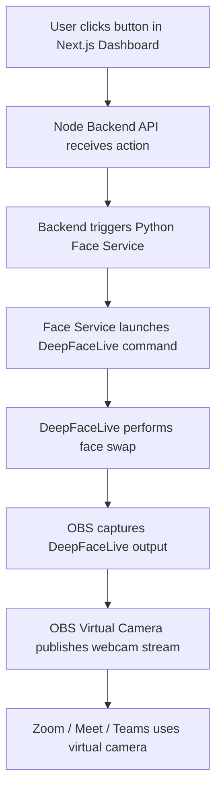
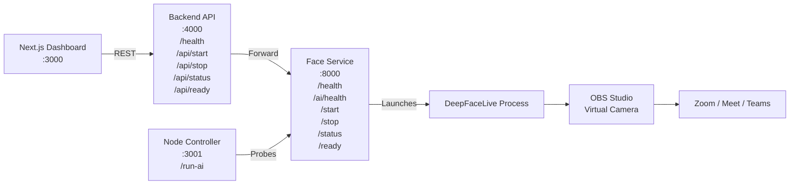

# VideoFaceLive

Multi-service setup for real-time face swap streaming using:

- Python (face pipeline service)
- DeepFaceLive (real-time face swap engine)
- Node.js (backend controller)
- Next.js (dashboard UI)
- WebRTC / OBS / Virtual Camera (video call output)

## Project Structure

```
.
├── apps
│   └── web                # Next.js dashboard
├── services
│   ├── backend            # Node.js API controller
│   └── face-service       # Python FastAPI process manager
├── docker-compose.yml
└── .env.example
```

## 1) Prerequisites

- Node.js 20+
- Python 3.11+
- OBS Studio (with Virtual Camera support)
- DeepFaceLive installed or available via command

## 2) Environment

Copy env file:

```bash
cp .env.example .env
```

Update `.env` for your DeepFaceLive command if needed:

```env
DEEPFACELIVE_CMD=python -m app.deepfacelive_stub
```

Example real command (replace paths as needed):

```env
DEEPFACELIVE_CMD=python /path/to/DeepFaceLive/main.py run --model /path/to/model
```

## 3) Run (Local Dev)

### Terminal 1: Node + Next.js

```bash
npm install
npm run dev:all
```

- Dashboard: `http://localhost:3000`
- Backend API: `http://localhost:4000`

### Terminal 2: Python Face Service

```bash
cd services/face-service
python -m venv .venv
source .venv/bin/activate
pip install -r requirements.txt
uvicorn app.main:app --host 0.0.0.0 --port 8000
```

## 4) Run (Docker Compose)

```bash
cp .env.example .env
docker compose up --build
```

Services:

- Web: `http://localhost:3000`
- Backend: `http://localhost:4000`
- Face service: `http://localhost:8000`

## 5) Dashboard Workflow

1. Open dashboard at `http://localhost:3000`.
2. Ensure **Ready: true** in the controller card (the Start button is disabled until ready).
3. Click **Start Face Swap**.
4. Check status (`running`, `pid`, command).
5. Click **Stop Face Swap** to terminate pipeline.

## 5.1) Next.js Dashboard (User Interface)

The Next.js app is the control center for backend, Python AI service, and controller checks.

Startup order (recommended):

1. Start Python face service:

```bash
cd services/face-service
/bin/python3 -m uvicorn app.main:app --host 127.0.0.1 --port 8000
```

2. Start backend API:

```bash
npm --workspace @videofacelive/backend run dev
```

3. Start Node controller layer:

```bash
npm run dev:controller
```

4. Start Next.js dashboard:

```bash
npm --workspace @videofacelive/web run dev
```

Open:

- Dashboard UI: `http://localhost:3000`
- Backend API: `http://localhost:4000`
- Face AI service: `http://localhost:8000`
- Node controller: `http://localhost:3001/run-ai`

## 6) WebRTC / OBS / Virtual Camera Flow

1. Run DeepFaceLive output into OBS scene.
2. In OBS, click **Start Virtual Camera**.
3. In dashboard, select OBS Virtual Camera in **Camera / Virtual Camera Preview**.
4. In Zoom/Meet/Teams, choose the same OBS Virtual Camera as your webcam.

This gives live face-swapped output in calls via standard WebRTC-compatible clients.

## 6.2) Video Call Integration (Method 1: Easiest / Industry Standard)

Pipeline:

DeepFaceLive -> OBS Virtual Camera -> Zoom

### Steps

1. Install OBS Studio on your local machine.
2. Open OBS and create a scene that contains your DeepFaceLive output.
	- Use Window Capture (or Display Capture) so OBS receives the swapped video.
3. In OBS, click Start Virtual Camera.
4. Open Zoom.
5. In Zoom video settings, choose OBS Virtual Camera as the camera.

### Result

Zoom treats OBS Virtual Camera as a normal physical webcam, so your live DeepFaceLive output is used as your camera feed.

### Quick checks if Zoom does not show video

- Confirm OBS preview is moving before starting the virtual camera.
- Confirm Start Virtual Camera was clicked in OBS.
- Re-open Zoom camera settings and re-select OBS Virtual Camera.
- Ensure no other app has locked the selected camera source.

## 6.3) Video Call Integration (Method 2: Google Meet / Microsoft Teams)

Use the same camera pipeline:

DeepFaceLive -> OBS Virtual Camera -> Meet/Teams

### Google Meet

1. Start your DeepFaceLive output and ensure OBS preview is active.
2. In OBS, click Start Virtual Camera.
3. Open Google Meet.
4. Go to Settings -> Video.
5. Set Camera to OBS Virtual Camera.

### Microsoft Teams

1. Start your DeepFaceLive output and ensure OBS preview is active.
2. In OBS, click Start Virtual Camera.
3. Open Microsoft Teams.
4. Go to Settings -> Devices.
5. Set Camera to OBS Virtual Camera.

### Result

Meet and Teams treat OBS Virtual Camera as a regular webcam, so your live face-swapped stream is used in calls.

## 6.4) Pre-Call Checklist (Zoom / Meet / Teams)

Run this quick order before joining a meeting:

1. Start DeepFaceLive and confirm live swapped preview.
2. Open OBS and confirm the DeepFaceLive output is visible in OBS preview.
3. Click Start Virtual Camera in OBS.
4. Open your meeting app and select OBS Virtual Camera as camera source.
5. Verify your self-preview in the meeting app before joining.

If video is missing or frozen:

- Re-check that OBS preview is moving.
- Stop/Start Virtual Camera once in OBS.
- Re-select OBS Virtual Camera in app settings.
- Close other apps that may lock webcam devices.
- Restart meeting app last (after OBS virtual camera is running).

### Ubuntu host helper

Use the host readiness script:

```bash
bash scripts/ubuntu_virtual_camera_check.sh
```

It checks OBS availability, `v4l2loopback` status, video devices, and prints the exact GUI flow for DeepFaceLive -> OBS -> Zoom/Meet/Teams.

Install prerequisites automatically on Ubuntu host:

```bash
sudo bash scripts/ubuntu_virtual_camera_install.sh
```

Reset/uninstall virtual camera setup on Ubuntu host:

```bash
sudo bash scripts/ubuntu_virtual_camera_reset.sh
```

## 6.1) Run DeepFaceLive for Real-Time Face Swap (Local, Not Colab)

This step runs on your local desktop/laptop (not in this dev container).

### Install DeepFaceLive

1. Download DeepFaceLive from the official repository releases page.
2. Install/extract it on your local machine.
3. Ensure your trained model file (for example `trained_model.dfm`) is available locally.

### Load trained model

1. Launch DeepFaceLive.
2. Open the model/source panel.
3. Load your exported `trained_model.dfm`.

### Select webcam input

1. In DeepFaceLive, set input/source to your physical webcam.
2. Confirm preview shows live camera frames.

### Enable virtual camera output

DeepFaceLive itself does not always provide a universal virtual camera on every OS setup.
Use one of these local options:

- OBS Virtual Camera (recommended cross-app workflow)
	1. Add DeepFaceLive output to an OBS scene (Window Capture / Display Capture).
	2. Click **Start Virtual Camera** in OBS.
	3. Select **OBS Virtual Camera** in Zoom/Meet/Teams.

- Linux virtual camera via `v4l2loopback` (advanced)
	1. Create a loopback camera device.
	2. Route DeepFaceLive output into that device (for example via FFmpeg/GStreamer).
	3. Select that loopback camera in your video call app.

### Output

Your virtual camera stream behaves like a normal webcam in conferencing apps.

### Optional: connect this repo's controller to real DeepFaceLive

Set `.env` to your real launch command, then start services:

```env
DEEPFACELIVE_CMD=python /path/to/DeepFaceLive/main.py run --model /path/to/trained_model.dfm
```

Then run:

```bash
docker compose up --build
```

## API Endpoints

Backend (`:4000`):

- `GET /health`
- `GET /api/status`
- `GET /api/ready`
- `POST /api/start`
- `POST /api/stop`

Face Service (`:8000`):

- `GET /health`
- `GET /status`
- `GET /ready`
- `POST /start`
- `POST /stop`

## Full System Flow

User clicks button (Next.js Dashboard)
	↓
Node API triggers AI (Backend + Controller)
	↓
Python processes video (Face Service)
	↓
DeepFaceLive swaps face
	↓
Virtual camera outputs to Zoom/Meet/Teams

Flow mapping in this repo:

1. Dashboard action calls backend API (`/api/start` or `/api/stop`).
2. Backend forwards control to face-service (`/start` or `/stop`).
3. Face-service runs the configured DeepFaceLive command.
4. DeepFaceLive output is captured by OBS.
5. OBS Virtual Camera is selected in Zoom/Meet/Teams as the webcam source.





## 7) Train Face Model (Python + DeepFaceLab + Google Colab)

Goal:

- Collect face images
- Train model on GPU (Colab)
- Export model as `trained_model.dfm`

Included files:

- `training/prepare_dataset.py`
- `training/requirements.txt`
- `training/colab_deepfacelab_train.ipynb`

### A. Collect face images locally

Install prep dependency:

```bash
python -m pip install -r training/requirements.txt
```

Extract frames from your source video(s):

```bash
python training/prepare_dataset.py --input /path/to/src_videos --output /tmp/data_src --frame-step 5 --prefix src
python training/prepare_dataset.py --input /path/to/dst_videos --output /tmp/data_dst --frame-step 5 --prefix dst
```

Zip each folder before uploading to Colab:

```bash
cd /tmp
zip -r data_src.zip data_src
zip -r data_dst.zip data_dst
```

Or use the one-command helper:

```bash
python training/package_for_colab.py --src /tmp/data_src --dst /tmp/data_dst --out /tmp
```

This creates:

- `/tmp/data_src.zip`
- `/tmp/data_dst.zip`

### B. Train in Google Colab (GPU)

1. Open `training/colab_deepfacelab_train.ipynb` in Colab.
2. Set runtime to **GPU**.
3. Upload and extract your `data_src.zip` and `data_dst.zip` into:
	- `/content/DeepFaceLab/workspace/data_src`
	- `/content/DeepFaceLab/workspace/data_dst`
	- or use the notebook config cell defaults: `SRC_ZIP=data_src.zip`, `DST_ZIP=data_dst.zip`
4. Run notebook cells in order:
	- install DeepFaceLab
	- extract aligned faces
	- train SAEHD model
	- export DFM

Notebook config variables:

- `SRC_ZIP` and `DST_ZIP` (uploaded ZIP filenames)
- `MODEL_NAME` (default `SAEHD`)
- `OUTPUT_DFM` (default `trained_model.dfm`)

### C. Output

The exported model path is:

```text
/content/DeepFaceLab/workspace/trained_model.dfm
```

Download it and place it in your local model directory used by this project.